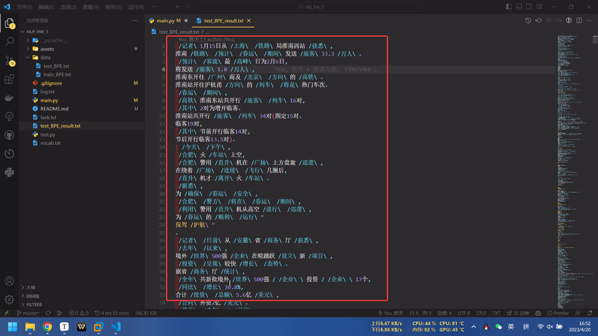

# NLP_HW_1:BPE算法中文子词切割

[TOC]

**思维导图：**


## 一、初始化语料库`corpus`

### 语料变量`corpus`

首先定义语料库存储的数据结构

```python
corpus = []
```

语料 一个二维数组，每个元素是一个`piece`，`piece`之间由**标点或数字**分割，`piece`是一个一维数组，每个元素是一个词汇(初始为一个单个的词)

`corpus`数据结构实例：


### 函数`punctuation_removal()`

首先编写`punctuation_removal()`函数

- 通过正则表达式`"[\u3000-\u303F\uFF00-\uFFEF\u2000-\u206F]"`匹配所有的中文标点符号，将其替换为`#`；
- 通过正则表达式`"[\u0021-\u002F\u003A-\u0040\u005B-\u0060\u007B-\u007E]"`匹配所有的英文标点符号，将其替换为`#`；
- 通过正则表达式`"[\d]"`匹配所有的数字，将其替换为`#`。

```python

```py
def punctuation_removal(text):
    # 将中文标点符号替换为#
    text = re.sub(r"[\u3000-\u303F\uFF00-\uFFEF\u2000-\u206F]", '#', text)
    # 将英文标点符号替换为#
    text = re.sub(r"[\u0021-\u002F\u003A-\u0040\u005B-\u0060\u007B-\u007E]", '#', text)
    # 将数字替换为#
    text = re.sub(r'[\d]', '#', text)
    return text
```

#### 弯路与优化：将数字也等同标点作为分割`piece`的依据

在这里，我一开始写的时**只移除中英文符号**，将其作为分割`piece`的依据，但是之后进行`BPE`算法后，呈现的结果却是这样的：


可以看到，词频最高的都是**连续的数字**，**把这些东西放进词典里并没有什么意义**，于是我**将数字也等同标点一起处理**，第一轮训练效果是这样的：


达到了令人满意的效果。

### 函数`init_corpus()`

编写`init_corpus()`函数

读取txt文件，将标点符号转换为#，并以空格分割，将每个词汇作为一个piece，将每个piece作为一个训练数据

```py
def init_corpus(txtfile):
    # 初始化语料库
    """
    读取txt文件，将标点符号转换为#，并以空格分割，将每个词汇作为一个piece，将每个piece作为一个训练数据
    """
    piece = []
    with open(txtfile, 'r', encoding="utf-8") as f:  # 读取文件
        for line in f: # 读取每一行
            line = punctuation_removal(line) # 将标点符号转换为#
            words = line.split(' ') # 以空格分割
            for word in words:
                if word == '#' or word == '#\n': 
                    #如果是标点符号分割开的，或者不同行的，必然不会是一个词汇，所以把他们放在不同的piece里面
                    corpus.append(piece)
                    # piece 作为一条训练数据你数据
                    # print(piece,"\n")
                    # time.sleep(1)
                    piece = []
                else:
                    piece.append(word)
    print(len(corpus))
    return corpus
```

首先，打开`txt`文件，读取每一行`lines`，将标点符号转换为`#`，并以空格分割，将每个词汇作为一个`piece`，将每个`piece`作为一个训练数据

> 至于为什么要分`piece`，如果是**标点符号分割开的**，或者**不同行的**，或者**由数字隔开的**，**必然不会是一个词汇**，所以把他们放在不同的`piece`里面**,能大大减少遍历所有相邻词汇时需要遍历的数量**

## 二、初始化词典`vocab`

### 词典变量`voacb`

```py
vocab = collections.defaultdict(int) *# 词典*
```

`collections.defaultdict(int)` 返回一个默认值为 0 的 `defaultdict` 对象，其中 `defaultdict` 是 `collections` 模块中的一个类，用于创建一个字典（`dict`）对象，可以指定字典中的默认值。

默认情况下，`dict` 对象在访问不存在的键时会抛出 `KeyError` 异常。而 `defaultdict` 对象在访问不存在的键时，会自动使用指定的默认值来创建一个新的键值对。

这种特性正好可以用来做`vocab`

### 函数`init_vocab()`:

```py
def init_vocab():
    global vocab # 词典
    for piece in corpus: # 语料库
        if len(piece): # 如果piece不为空
            for word in piece: # piece中的每个词汇 
                vocab[word] += 1 #  
    print('Vocab size: {}'.format(len(vocab))) # 词典大小
    return vocab
```

`init_vocab()`的作用是**初始化词典**。在代码中，首先声明了一个名为全局变量 `vocab` ，用于存储词典。这样任何修改都会在程序层面被保存。

然后遍历 `corpus` 语料库中的每个 `piece`，如果该 `piece` 长度不为0（不为空），则遍历 `piece` 中的每个 `word`，并将其添加到词典中。如果词典中已经存在该 `word`，则将其**频次加1**；否则，将该 `word` 添加到词典中，**并将其频次初始化为1**。

最后，打印出词典的大小，并返回词典。该函数应该是一个初始化函数，旨在用于生成词典。

## 三、编写生成词典的主函数`get_frequency_merge_max()`

### *Step.1* 找出语料库中最频繁出现相邻的两个词汇

```py
    global corpus #     语料库
    global vocab # 词典
    pairs = collections.defaultdict(int) # 词对
    for piece in corpus: # 语料库
        for i in range(len(piece) - 1): # 每个piece中的词汇
            pairs[piece[i], piece[i + 1]] += 1 # 词对的频率
    # print('Pairs size: {}'.format(len(pairs)))
    sorted_pairs  = sorted(pairs.items(), key=lambda x: x[1], reverse=True) # 词对按照频率从大到小排序
    max_pair = sorted_pairs[0] # 词频最大的词对
```

总目的是根据语料库 `corpus` 生成词对，并根据词对的频率进行排序，得到频率最高的词对 `max_pair`。

- 首先声明两个全局变量 `corpus` 和 `vocab`，然后使用 `collections.defaultdict(int)` 创建了一个空的词对字典 `pairs`。然后遍历 `corpus` 语料库中的每个 `piece`，对于每个 `piece` 中的**相邻两个词汇**，将它们作为一个**词对** `(piece[i], piece[i + 1])`，并将**词对出现的频率加1**，以此来生成**词对字典** `pairs`。
- 接着，使用 `sorted()` 函数将词对字典 `pairs` 按照词对出现的频率从大到小进行排序，并存储到 `sorted_pairs` 中。这里使用了 `lambda` 表达式作为排序关键字，**表示按照词对的第二个元素（即频率）进行排序**。
- 最后，将排序后的词对字典 `sorted_pairs` 的第一个元素作为频率最高的词对 `max_pair`

### *Step.2* 将`vocab`中的词汇进行合并`merge_vocab(pair)`

```py
def merge_vocab(pair):
    global vocab
    vocab[pair[0]+ pair[1]] = vocab[pair[0]] + vocab[pair[1]]
```

很简单，只需要新建一个在`vocab`中，将`pair`中所指示的两个词合并后即可。

#### 弯路：合并时将原来的词汇删除了

一开始我以为，合并为一个词汇后，原来的单词应该被删除，后来一直跑一直才发现，这词典大小怎么时减小时不变呢？


那时写的是这样的：

```py
print("现在合并的词汇是",pair,"词典大小",len(vocab))
print(vocab[pair[0]],vocab[pair[1]])
vocab[pair[0]+ pair[1]] = vocab[pair[0]] + vocab[pair[1]]
del vocab[pair[0]]
del vocab[pair[1]] 一开始以为是词典大小减小，笑了
print(vocab[pair[0]+ pair[1]])
print("合并后的词典大小",len(vocab),'\n')
```

直到全部print才发现。:joy:

### *Step.3* 将`corpus`中的词汇进行合并

```py
    # 将corpus中的词汇进行合并
    for j in range(len(corpus)): # 遍历语料库
        if len(corpus[j]) >= 2: # 如果piece中的词汇大于等于2
            for i in range(len(corpus[j]) - 1): # 遍历piece中的词汇
                if corpus[j][i] == max_pair[0][0] and corpus[j][i + 1] == max_pair[0][1]: # 如果词汇和最大词对中的词汇相同
                    corpus[j][i] = max_pair[0][0] + max_pair[0][1] # 将词汇合并
                    corpus[j][i+1] = '' # 将词汇合并
        corpus[j] = [s.strip() for s in corpus[j] if s.strip()] # 去除空格
```

这段代码实现了语料库中的词汇合并操作。

代码通过循环遍历语料库`corpus`中的每个条目`piece`，每个条目都是一个包含文本中单词的列表。如果某个列表（即`piece`）包含两个或更多单词，代码就会遍历该列表**除最后一个单词以外**的每个单词。

如果当前单词和**下一个单词**与之前确定的`max_pair`的第一个和第二个单词匹配，那么这两个单词将被**合并成一个单词**，即通过将它们**连接起来形成一个新单词**，同时将第二个单词设置为空字符串。

最后，代码使用**列表推导式**从列表中去除额外的空白。列表推导式会对列表中的每个条目进行去空格处理并移除空条目，这样就得到了一个已经合并了相应单词的语料库。

## 四、进行训练，使`vocab`扩大到10000

```py
if __name__ == '__main__':
        init_corpus('./data/train_BPE.txt')
        init_vocab()
        while len(vocab) < 10000:
            get_frequency_merge_max()
            
            print((len(vocab)-5994)/(10000-5994)*100,"%")
            if len(vocab)%100 == 0:
                with open('./vocab.txt', 'w', encoding="utf-8") as f:
                    f.write(str(vocab))
```

首先初始化语料库 `init_corpus('./data/train_BPE.txt')`

然后初始化词典 `init_vocab()`

然后进入循环，只要`vocab`还没有扩大到10000，就不断调用`get_frequency_merge_max()`进行寻找最大词频词汇，并进行合并。

过程中不断以百分比形式进行显示训练进度：


然后`vocab`每扩大100个词汇，就把它save一下到`'./vocab.txt'`，最后训练好后的词典长这样：


可以看到，有两个、三个、四个字的词汇。

在训练的过程中，每个合并的词汇都存放在了`'./log.txt'`中：


训练过程大约持续了**两个小时**左右。

## 五、使用测试集进行测试词典

### *Step.1*读取词典`load_vocab()`

```py
def load_vocab():
    global vocab
    # 打开文件并读取所有行
    with open('vocab.txt', 'r', encoding='utf-8') as f:
        lines = f.readlines()

    # 将所有行合并为一行
    merged_line = ''.join(lines)

    vocab = eval(merged_line)
```

1. 打开文件`"vocab.txt"`，并以utf-8编码方式读取所有行。

2. 将文件中所有行合并为一行，存储在变量`merged_line`中。

3. 使用eval()函数将`merged_line`转换为**Python字典**，并将其存储在变量`vocab`中。

这样就完成了词典的读取。

### *Step.2* 读取测试集`read_test_file()`

```py
def read_test_file():
    with open('./data/test_BPE.txt', 'r', encoding='utf-8') as f:
        lines = f.readlines()
    
    with open('./test_BPE_result.txt', 'w', encoding='utf-8') as f:
        for line in lines:
            line = line.replace(' ', '')
            line = line.replace('\n', '')
            sentences = re.split(r'([, 。？！；’ ‘ “ ” 、])', line)
            i = 0
            while i < len(sentences) - 1:
                f.write(BPE_split(sentences[i])+sentences[i+1]+'\n')
                i = i+2
```

1. 打开测试文件`"test_BPE.txt"`，并以utf-8编码方式读取所有行。

2. 循环遍历文件中的**每一行**，将行中的**空格**和**换行符**去除。

3. 使用**正则表达式**`r'([, 。？！；’ ‘ “ ” 、])'`，用标点进行分割，将行拆分成句子，将句子和分隔符分别存储在列表`sentences`中。

4. 循环遍历sentences中的每一对句子和分隔符，使用`BPE_split()`函数对句子进行**分词处理**，然后将结果和分隔符写入文件`"test_BPE_result.txt"`中。

这样就完成了词典的读取。使用词典的函数为 `BPE_split()`。

### *Step.3* 使用读取的词典利用BPE算法进行分词操作`BPE_split()`

```py
def BPE_split(sentence):
    global vocab
    # 从后往前遍历句子
    for i in range(len(sentence)-1, 0, -1):
        # 将句子中的两个字符组成一个新的字符
        new_char = sentence[i-1] + sentence[i]
        # 如果新的字符在词典中，则将新的字符替换原来的两个字符
        if new_char in vocab:
            sentence = sentence.replace(new_char, ' /'+new_char+'\\ ')
            # 从头开始遍历
            i = 0

    return sentence
```

主要的思想是：

从**最长的子字符串**开始遍历，**依次检查是否在词表中出现**。如果出现，则将该子字符串作为一个词语加入分词结果，并从字符序列中删除该子字符串，继**续遍历剩余部分**。如果所有的子字符串都不在词表中出现，则将**最长的子字符串拆分为两部分**，继续遍历.

主要步骤如下:

1. 从后往前遍历输入的句子。
2. **每次遍历时**，将相邻的两个字符组成一个新的字符，并在词汇表中查找该新字符是否存在。
3. 如果该新字符在词汇表中存在，则将句子中的这两个字符替换为新字符，并用特殊字符`/`和"`\`将新字符包围起来
4. 在替换完成后，重新从头开始遍历句子。
5. 最后返回分词处理后的句子。

## 分词的效果


